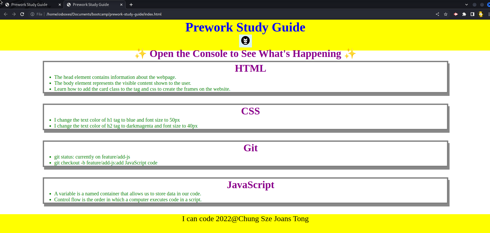

Prework study guide

## Description

Provide a short description explaining the what, why, and how of your project. Use the following questions as a guide:

- What was your motivation? learn coding
- Why did you build this project? To know how much I understand the course
- What problem does it solve?I've solved the problems of how to upload the code to github with SSH
- What did you learn? javascripts functions

## Table of Contents (Optional)

If your README is long, add a table of contents to make it easy for users to find what they need.

- [Description](#description)
- [Table of Contents (Optional)](#table-of-contents-optional)
- [Installation](#installation)
- [Usage](#usage)
- [Credits](#credits)
- [License](#license)
- [Badges](#badges)
- [Features](#features)
- [How to Contribute](#how-to-contribute)
- [Tests](#tests)

## Installation

web browser like chrome, Edge , Firefox, Safari

## Usage

Provide instructions and examples for use. Include screenshots as needed.

To add a screenshot, create an `assets/images` folder in your repository and upload your screenshot to it. Then, using the relative file path, add it to your README using the following syntax:
prework-study-guide/assets/image

## Credits

Chungsze

If you used any third-party assets that require attribution, list the creators with links to their primary web presence in this section.

https://courses.bootcampspot.com/courses/3095/modules#module_32055

## License

The last section of a high-quality README file is the license. This lets other developers know what they can and cannot do with your project. If you need help choosing a license, refer to [https://choosealicense.com/](https://choosealicense.com/).

---

🏆 The previous sections are the bare minimum, and your project will ultimately determine the content of this document. You might also want to consider adding the following sections.

## Badges

Badges aren't necessary, but they demonstrate street cred. Badges let other developers know that you know what you're doing. Check out the badges hosted by [shields.io](https://shields.io/). You may not understand what they all represent now, but you will in time.

## Features

html, css,  Javascript

## How to Contribute

If you created an application or package and would like other developers to contribute to it, you can include guidelines for how to do so. The [Contributor Covenant](https://www.contributor-covenant.org/) is an industry standard, but you can always write your own if you'd prefer.

## Tests

Go the extra mile and write tests for your application. Then provide examples on how to run them here.